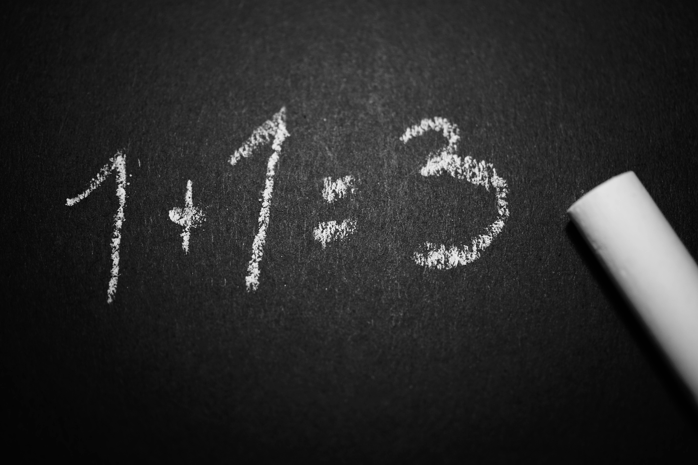

# MathGame

<p align="content">
    
</p>


**MatGame** o por su otro nombre **Suifty** es un programa por terminal pensado para ser de apoyo con juegos matemáticos didácticos para niños, los cuales se encuentran cursando su escuela primaria, abarcando desde 1.º hasta 6.º grado.

Contando con dos modalidades de juego: Aprendizaje y reto.

## Tabla de contenidos

- [Descarga](#Descarga)
- [Explicación](#Explicación)


## Descarga

Podrás obtener todos los archivos necesarios para ejecutar el script sin ningún problema, tanto en Windows como en Linux, ten en cuenta que lo que cambiara en ambos será la forma de referirte a los directorios.

Para ejecutarlo con el script, ocupará instalar las siguientes librerías con pip:

```
pip install statistics
pip install pillow
pip install tkinter
```

Finalmente, te clonas el repositorio y puedes ejecutar el script correspondiente a tu sistema operativo:

```bash
git clone https://github.com/sammy-ulfh/MathGame.git 
```

Una forma principal para **Windows** sería tomar únicamente el archivo **Suifty_WindowsApp.rar** y extraerlo, este tendrá un ejecutable y en principio debería funcionar sin tener las librerías instaladas.


## Explicación

__Suifty__ está diseñado para ser didáctico y fácil de usar. Para ello se emplearon matrices, funciones, condicionales y librerías como __random__, __statistics__, __pillow__ y __tkinter__.

Además, abarca 3 temas distintos en cada uno de los 6 grados de primaria, generando una funcionalidad más didáctica y contando con dos modalidades de juego:

- **Reto:**

    Reto es un apartado donde el usuario pone a prueba sus conocimientos. Se seleccionan de forma random de 10-25 ejercicios de los  grados y temas para hacer una sola pregunta y repetirlo así las veces que se vayan a realizar preguntas.

    Además, reto trabaja con una función interesante, la cual te generará un certificado pidiendo tu nombre, y, en caso de terminar con un promedio mayor a 8, mapeará el nombre de la persona y le permitirá descargar su certificado con nombre.

- **Aprendizaje:**

    La modalidad de aprendizaje te permite mediante 6 menús la selección del tema a practicar en su respectivo grado, agregando además el retorno de la respuesta correcta en caso de equivocarse. 

Como dato adicional, al final del todo siempre te dirá cuántas respondiste bien y cuantas mal en ambas modalidades.

- ### *Librerías*

    - __Random__:
        Random se utiliza para crear una funcionalidad con mayor alcance en el programa, ya que ayuda a generar números aleatorios para que los ejercicios del tema en concreto se vayan creando sobre la marcha, así como los cálculos para obtener la respuesta y compararla con el dato que ingreso el usuario.

        Además, se emplea en las listas, uno de los ejemplos es para desordenar una lista y mezclar sus valores.

    - __Statistics__:
        Statistics se utiliza sobre todo para emplear operaciones sobre las listas, como el caso de la moda, aquí nos saca el valor en concreto, el cual se comparara con la respuesta del usuario para verificar si es correcta.

    - __Pillow__:
        Pillow es utilizado para el manejo de imágenes, en múltiples ocasiones maneja las imágenes accediendo a ellas y mostrándolas al usuario, en ejercicios de primer grado sobre todo o cuando se genera el certificado sobre el modo de juego para desafiar sus habilidades.

    - __Tkinter__:
        Tkinter se utiliza cuando generamos el certificado para aquel usuario que obtuvo un promedio mayor a 8 en el apartado de reto, mapeando el nombre del usuario de forma correcta y centrada.

- ### *Funciones*

    - __Main__:
        La función main es nuestro menú principal y donde se decide el flujo del programa, por un lado, está el modo de aprendizaje, donde el usuario tendrá que decidir sobre que grado y tema serán sus preguntas, mientras que en reto son de 10-20 preguntas aleatorias, de cualquier tema o grado donde finalmente obtendrías un certificado con tu nombre de tener un promedio mayor a  8.

        Además, luego de que se haya ejecutado todo, el programa pregunta al usuario si desea seguir jugando, si este responde que sí, seguirá el flujo del programa, de lo contrario se terminara de ejecutar.

    - __Reto__:
        La función reto principalmente pide el nombre del usuario y da algunos mensajes como indicaciones principales, de ahí el flujo será solicitar de forma randon a la función de algún grado la generación de una pregunta para uno de sus temas, elegido aleatoriamente, hará esto repetidas ocasiones hasta completar las preguntas que se le harán al usuario.

        Finalmente, si el usuario saca un promedio de 8 basándonos en sus respuestas correctas, se le otorgará un certificado, empleando el uso de la función certificado.

    - __imagen__:
        En esta función se trabaja el manejo de imágenes empleando tanto la librería pillow como tkinter, para poder mostrársela al usuario y una vez se cierre la imagen pueda seguir el flujo del programa.

    - __Certificado__:
        En esta función se utiliza principalmente pillow para abrir y manipular la imagen del certificado, donde con base en el número de letras del nombre del usuario se hace un centrado para que quede representado de la mejor manera posible.

        Además, al momento de colocar el texto, se emplea una fuente específica, la cuál es **Gabriola.ttf**.

    - __1.º Grado__
        
        - __Aprende a contar:__
            Mediante el uso de las imágenes te muestra alguna cosa fácil de reconocer para contarla y te pregunta cuantos de ellos hay, la respuesta este ya está previamente almacenada en la matriz de apoyo.

        - __Aprende a sumar:__
            Mediante el uso de las imágenes te muestra objetos y pregunta cuanto da la suma de ellos, la respuesta ya está previamente almacenara en la matriz de apoyo.

        - __Aprende a restar:__
            Mediante el uso de las imágenes te muestra objetos y pregunta cuanto da la resta de ellos, la respuesta ya está previamente almacenara en la matriz de apoyo.

    - __2.º Grado__

        - __Secuencias numéricas crecientes:__
            genera secuencias o listas empleando la librería random, además de ordenarlas de menor a mayor, para que el usuario fácilmente pueda determinar el valor faltante en la posición que se ha colocado como "vacía".

        - __Secuencias numéricas decrecientes:__
            genera secuencias o listas empleando la librería random, además de ordenarlas de menor a mayor, para que el usuario fácilmente pueda determinar el valor faltante en la posición que se ha colocado como "vacía", tendrá que determinarlo de forma decreciente.

        - __Encuentra el número faltante:__
            Se generan números aleatorios para emplear una suma, pone en "vacío" uno de los datos a sumar, de esta manera el usuario tendrá que ingresar su respuesta y el programa realizará su comprobación.

    - __3.º Grado__

        - __Aprende a multiplicar:__
            Genera de forma aleatoria números para realizar sus multiplicaciones con un tope considerado para el grado que es, generando la respuesta para la comprobación con lo que ingrese el usuario.

        - __Aprende a dividir:__
            Genera de forma aleatoria números para realizar sus divisiones con un tope considerado para el grado que es, generando la respuesta para la comprobación con lo que ingrese el usuario.

        - __Aprende a reconocer el número mayor:__
            Se generaran preguntas en las cuales se mostraran dos números, el usuario tendrá que responder cuál de ellos es mayor.

    - __4.º Grado__

        - __Áreas de cuadrados:__
            Contendrá una lista como material de apoyo la cual almacenara la forma de la figura formada con '*'.

            Además, se brindará la fórmula y se generarán de forma aleatoria los datos necesarios para resolver el ejercicio.

        - __Áreas de rectángulos:__
            Contendrá una lista como material de apoyo la cual almacenara la forma de la figura formada con '*'.

            Además, se brindará la fórmula y se generarán de forma aleatoria los datos necesarios para resolver el ejercicio.

        - __Áreas de triángulos:__
            Contendrá una lista como material de apoyo la cual almacenara la forma de la figura formada con '*'.

            Además, se brindará la fórmula y se generarán de forma aleatoria los datos necesarios para resolver el ejercicio.

    - __5.º Grado__

        - __Suma con decimales:__
            En este tema se generan números decimales de forma aleatoria, de forma que para su comprobación se suman y se comparan con lo que ingreso el usuario.

        - __Resta con decimales:__
            En este tema se generan números decimales de forma aleatoria, de forma que para su comprobación se restan y se comparan con lo que ingreso el usuario.

        - __Encuentra el número faltante en la multiplicación:__
            Se genera una multiplicación de forma aleatoria y uno de los números que se multiplica se coloca como "vacío", para luego comprobar el dato almacenado con la respuesta del usuario.

    - __6.º Grado__

        - __Media/Promedio:__
            Para la media se genera una lista con datos aleatorios y después se ordena de menor a mayor, para facilitarle al usuario su resolución.

        - __Mediana:__
            Para la mediana se genera una lista con datos aleatorios y después se ordena de menor a mayor, para facilitarle al usuario su resolución.

        - __Moda:__
            Se genera una lista de forma aleatoria y para asegurar que un dato se repita mayores veces que otros, se agrega uno de una posición tomada de forma aleatoria, al final del todo.

            Finalmente, se desordena la lista, para tener una mejor estética a que solo se vean al final los números y mediante el uso de la función statistics obtener la moda, para la comparación con la respuesta del usuario.

    - __Matriz_respuestas__

        Esta función almacena todas las respuestas y material de apoyo sobre los ejercicios que se emplean en cada uno de los grados, además dentro mismo de acuerdo a porque grado y tema fue llamado, generara el ejercicio y la respuesta correspondiente, de esta manera puede acceder fácilmente a la matriz, que puede contar como un material de apoyo.

        Si se modificara o agregara algo al ejercicio, se tendría que hacer modificación de esta función.
